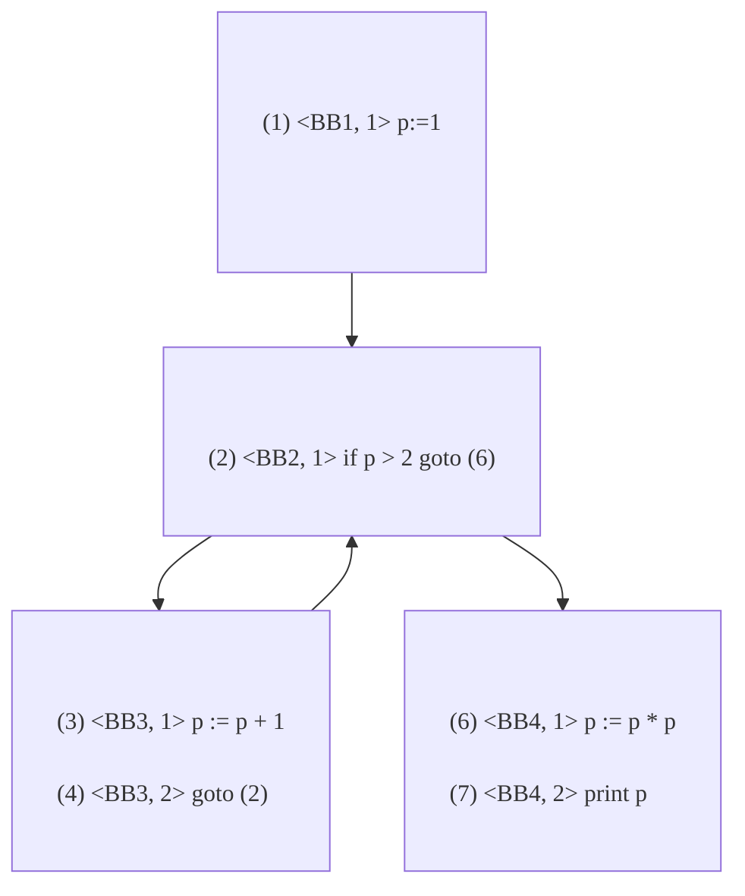

# 9. 目标代码生成和代码优化

## 流图

### 基本块

- 只有一个入口语句、一个出口语句；只考虑极大基本块

#### 入口语句

程序的第一条语句

跳转语句的跳转目标语句

条件跳转语句的相邻语句

#### 划分方法

- 求出各个基本块的入口语句

  ```pascal
  p := 1            // entrance
  if p > 2 goto (6) // entrance [target of 4]
  p := p + 1        // entrance [nextstmt of 2]
  goto (2)
  p := p + p
  p := p * p        // entrance [target of 2]
  print p
  ```

- 由入口语句向下延伸至下一入口语句(不包含)/某跳转语句/某停语句，为一个块

  ```pascal
  p := 1            // <---block1--->
  if p > 2 goto (6) // <---block2--->
  p := p + 1        // <---block3
  goto (2)          //     block3--->
  p := p + p // not in any basic block
  p := p * p        // <---block4
  print p           //     block4--->
  ```
  
- 没有包含进来的块可以被删除了；基本块和包含在基本块里面的语句都编号

  ```
  +-------------------------------+
  |(1) <BB1, 1> p := 1            |
  |-------------------------------|
  |(2) <BB2, 1> if p > 2 goto (6) |
  |-------------------------------|
  |(3) <BB3, 1> p := p + 1        |
  |(4) <BB3, 2> goto (2)          |
  |-------------------------------|
  |(6) <BB4, 1> p := p * p        |
  |(7) <BB4, 2> print p           |
  +-------------------------------+
  ```

### 流图

给基本块加上边信息。有两种情况需要加边(i->j)：

- j是i后面相邻的块，且i不以无条件跳转语句/停语句/返回语句结尾
- j是i跳转的目标地址

流图的首节点是唯一的，并且可以到达任意节点



### 循环

> 重要的是回边！

设n0为首结点

- 支配结点：如果从首节点到n的**通路必经过**m，那m就是n的支配结点m DOM n

  - n0 DOM n
  - n DOM n

- 支配结点集：D(n)

- 回边：如果d DOM n，那么n->d就是回边

  - 上图的回边：BB3-->BB2

- 自然循环（循环）是针对回边而言的，它由回边n->d的两端n, d以及**可以不经过d到达n的所有节点**组成

  - 显然，d是该循环的唯一入口。如果有其他入口，那么从其他入口可以不经过d到达n，d就不是n的支配结点了。

  - 循环是强连通的=两点之间必有路。

  - 循环从直观上来看分为两部分：一部分是从d到n的所有通路；另一部分是从n到d的回边。

    
  
    <p style="text-align:center;color:#878787">红框显示的两部分。循环一定长这样！</p>

## 数据流分析

> 这节真尼玛的蝻啊


