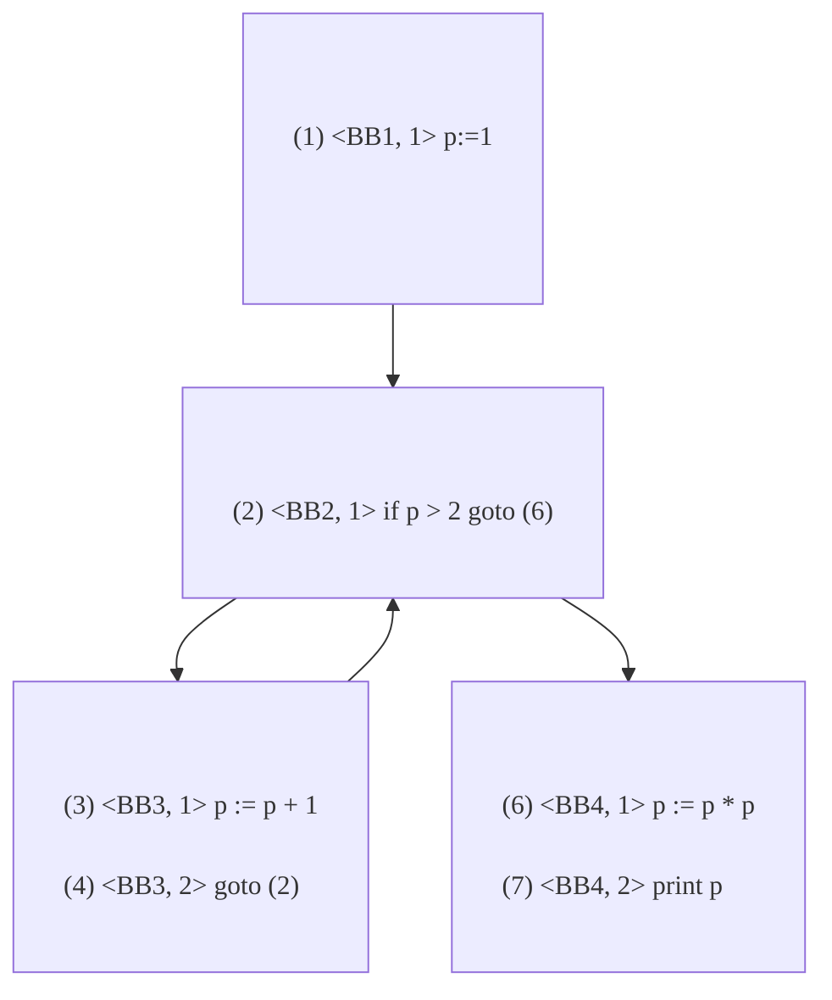
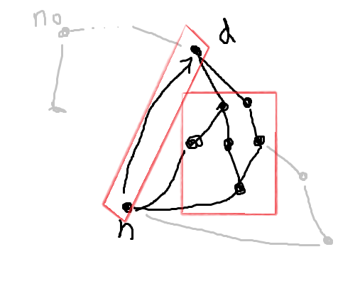
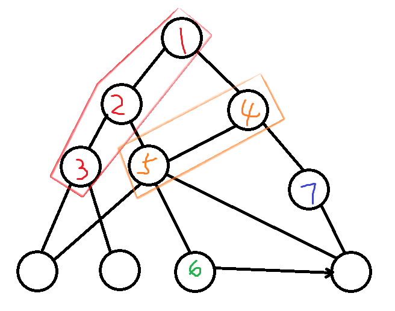

9. 目标代码生成和代码优化

## 流图

### 基本块

- 只有一个入口语句、一个出口语句；只考虑极大基本块

#### 入口语句

程序的第一条语句

跳转语句的跳转目标语句

条件跳转语句的相邻语句

#### 划分方法

- 求出各个基本块的入口语句

  ```pascal
  p := 1            // entrance
  if p > 2 goto (6) // entrance [target of 4]
  p := p + 1        // entrance [nextstmt of 2]
  goto (2)
  p := p + p
  p := p * p        // entrance [target of 2]
  print p
  ```

- 由入口语句向下延伸至下一入口语句(不包含)/某跳转语句/某停语句，为一个块

  ```pascal
  p := 1            // <---block1--->
  if p > 2 goto (6) // <---block2--->
  p := p + 1        // <---block3
  goto (2)          //     block3--->
  p := p + p // not in any basic block
  p := p * p        // <---block4
  print p           //     block4--->
  ```
  
- 没有包含进来的块可以被删除了；基本块和包含在基本块里面的语句都编号

  ```
  +-------------------------------+
  |(1) <BB1, 1> p := 1            |
  |-------------------------------|
  |(2) <BB2, 1> if p > 2 goto (6) |
  |-------------------------------|
  |(3) <BB3, 1> p := p + 1        |
  |(4) <BB3, 2> goto (2)          |
  |-------------------------------|
  |(6) <BB4, 1> p := p * p        |
  |(7) <BB4, 2> print p           |
  +-------------------------------+
  ```

### 流图

给基本块加上边信息。有两种情况需要加边(i->j)：

- j是i后面相邻的块，且i不以无条件跳转语句/停语句/返回语句结尾
- j是i跳转的目标地址

流图的首节点是唯一的，并且可以到达任意节点



### 循环

> 重要的是回边！

设n0为首结点

- 支配结点：如果从首节点到n的**通路必经过**m，那m就是n的支配结点m DOM n

  - n0 DOM n
  - n DOM n

- 支配结点集：D(n)

- 回边：如果d DOM n，那么n->d就是回边

  - 上图的回边：BB3-->BB2

- 自然循环（循环）是针对回边而言的，它由回边n->d的两端n, d以及**可以不经过d到达n的所有节点**组成

  - 显然，d是该循环的唯一入口。如果有其他入口，那么从其他入口可以不经过d到达n，d就不是n的支配结点了。

  - 循环是强连通的=两点之间必有路。

  - 循环从直观上来看分为两部分：一部分是从d到n的所有通路；另一部分是从n到d的回边。

    
  
    <p style="text-align:center;color:#878787">红框显示的两部分。循环一定长这样！</p>

## 数据流分析

> 这节真蝻啊

### 数据流方程

向前流的正向数据流方程：离开程序单元的数据流信息由进入程序单元的数据流信息决定

向后流的反向数据流方程

**前后是根据有向边的方向确定的。由于循环的存在，求解数据流方程需要靠迭代法。**

### 到达-定值数据流分析

- 定值：一条TAC语句可能赋值给A，该语句的位置叫做A的定值点
- 杀死：遇到A的新的定值点，则旧的定值点被杀死
- 定值点d到达p：有一条从d到p的路径，且d未被杀死

定义如下集合：

- in[B]：各个变量所有的到达B的定值点集合
- out[B]：所有到达B出口的定值点集合
- gen[B]：B当中产生的、且能够到达出口的定值点集合
- kill[B]：到达B且在B中杀死的定值点集合（到达B的、在B中重新定值）
- out[B] = (in[B] - kill[B]) + gen[B]

^ 到达-定值数据流是正向数据流

- in[B]=&bigcup;(out[b]) for b in P<sub>red</sub>[B]  ...  前驱基本块的out决定了这个块的in

^ 上述两个式子：到达-定值数据流方程

### 活跃变量数据流分析

- 活跃的：如果存在一条通路(p, q)使得q使用了p点处的a的值，那么a在p是活跃的，否则a在p是死亡的

  - 如果a在某个位置p以后，到a的下一个定值点之前还存在引用，那么a在p就是活跃的

  - 比如

    ```
    int a = 5;
    int b = 1;
    int c = a;
    int d = c;
    a = 3;
    b = 2;
    b = b + 1;
    c = a + b;
    ```

    | L=活跃 | 1    | 2    | 3    | 4    | 5    | 6    | 7    | 8    |
    | ------ | ---- | ---- | ---- | ---- | ---- | ---- | ---- | ---- |
    | a      | L    | L    | L    | D    | L    | L    | L    | L    |
    | b      | D    | D    | D    | D    | D    | L    | L    | L    |

    a有两个定值点1和5，两个引用点3和8；定值点1的最后一次引用是3，所以a在[1,2,3]都是活跃的，而4就是死亡的；在5重定值后在8最后一次引用，所以[5..8]处都是活跃的。

    b的定值点为2,6,7，引用点为7,8。定值点2没被引用过，所以从2到5都是死亡的。因为7对6有一次引用，所以6和7都是活跃的；同时7也是定值点，在8用到了该值，所以8也是活跃的。

  - 可见，变量在某一点是否活跃，要依赖于其后面的引用点（包括该点）和定值点（不包括该点）的信息。引用点先于定值点的则活跃；否则死亡。

    - 注意b=b+1这种，引用是先于定值的。+=、-=、++、--是一样的

- LiveIn[B]: B入口处活跃的变量集合

- LiveOut[B]: B出口处活跃的变量集合

- Def[B]: B中首次定值前未引用的变量集合

- LiveUse[B]: B中首次被定值前引用的变量集合

- LiveIn[B] = (LiveOut[B] - Def[B]) + LiveUse[B]

  - 如果在B中，首次出现的是引用(LiveUse)，那么在入口处肯定是活跃的
  - 如果首次出现的是定值(Def)，那么在入口处肯定是不活跃的
  - 如果引用和定值都没出现，那么继承LiveOut

^活跃变量数据流是反向数据流

- LiveOut[B] = &bigcup;(LiveIn[b]) for b in S<sub>ucc</sub>[B]   ...  后继基本块的LiveIn决定了LiveOut

^活跃变量数据流方程

### UD链和DU链

这个起名字很有意思。“引用-定值链”是从引用点出发追溯它的定值点，“定值-引用链”则相反。

> 一个变量在一个引用点的引用-定值链是指所有能到达该点的定值点集合
>
> 一个变量在一个定值点的定值-引用链是指该点能到达的所有引用点集合

#### 引用-定值链

在到达-定值数据流的基础上进行分析：
变量a在引用点p的UD链是**所有能到达p的定值点**的集合。在p所在的块B中：

- 如果块里面在p前面已经有最近定值点d，那么a在p的UD链只有一个点{d}
- 如果块里面没有定值点，就从In[B]里面找a的定值点作为UD链

#### 定值-引用链

利用**DU链数据流方程**，它是对活跃变量数据流方程集合定义的扩展（增加了引用点，加粗表示）：

- LiveUse[B]={(**s,**A)}，**s是引用点**，A是引用的变量，且引用点前面没有定值点
  - 注意，这样的话，同一个A可能对应多个s！只要是前面没有定值点的引用点都可以算进来！
- Def[B]={(**s,**A)}，**s是引用点**，A是引用的变量，该变量在B中被定值，而s是**该变量的所有定值点**
  - 其实不需要计算这个s。在数据流方程中，Def[B]的作用是对LiveOut做减法，那么只需要把所有的含A的减掉就可以了

这样，LiveOut[B]就包含了所有的从该块离开后仍然被后续引用的变量**以及所有的引用点**

变量a在定值点p的DU链是该定值点**可以到达的所有引用点**的集合。在p所在的块B内，

- 如果变量a在B内的p后面有定值点，那么DU链就局限于两个定值点之间的引用点
- 否则，LiveOut[B]中变量a对应的引用点就是DU链。

### 待用信息和活跃信息

我们要知道每个变量下一次使用的情况和活跃的情况，就要在式子上把这两个情况标出来。

在p点，nextuse(X) 说明了变量X紧接着一次被使用的情况。

live(X)说明了变量X当前的活跃信息（活跃L，不活跃F）。

计算时从后往前。

#### 一个基本块内的待用信息

计算顺序从后往前。在各个语句，要把发生改变前的信息记录下来。表格中每行表示记录下来的信息。计算流程是：

- 遇到一个语句，先把左侧的nextuse记录下来，然后修改左侧的nextuse；
- 之后把右侧的nextuse记录下来，然后修改右侧的nextuse。

下表表示了“计算完第i行以后的nextuse表”和“第i行记录的nextuse旧信息”。

表中-表示“和下一行相同”

- 先把左侧的nextuse旧值记在变量旁边，旧值可以查阅对应列的**最上面一行**；然后把对应位置nextuse改了
- 然后把右侧的nextuse旧值也记在变量旁边，然后把对应位置nextuse改成行号

横杠表示有过激烈的斗争：左侧改了，右侧又改。

显然，在语句上标的数字表示“我下一次用在第几行”，0表示“已经没有下一次了”。

| 行号 | 语句       | [a]  | [b]  | [c]  | [t]  | [u]    | [v]  |
| ---- | ---------- | ---- | ---- | ---- | ---- | ------ | ---- |
| 1    | t3:=a0-b0  | 1    | 1    | -    | 0    | -      | -    |
| 2    | u3:=u0-c0  | -    | -    | 2    | -    | ~~0~~2 | -    |
| 3    | v4:=t0+u4  | -    | -    | -    | 3    | 3      | 0    |
| 4    | c0:=v0+u0  | -    | -    | 0    | -    | 4      | 4    |
|      | （初始化） | 0    | 0    | 0    | 0    | 0      | 0    |

我们把上面表中的信息补全

| 行号 | 语句       | [a]   | [b]   | [c]   | [t]   | [u]   | [v]   |
| ---- | ---------- | ----- | ----- | ----- | ----- | ----- | ----- |
| 1    | t3:=a0-b0  | **1** | **1** | 2     | **0** | 2     | 0     |
| 2    | u3:=u0-c0  | 0     | 0     | **2** | 3     | **2** | 0     |
| 3    | v4:=t0+u4  | 0     | 0     | 0     | **3** | **3** | **0** |
| 4    | c0:=v0+u0  | 0     | 0     | **0** | 0     | **4** | **4** |
|      | （初始化） | 0     | 0     | 0     | 0     | 0     | 0     |

可以看到，右边的信息可由最上面一行和语句的记录信息复原。很简单：

- nextuse\[i\]\[a\]=nextuse\[i-1\][a] if a is not used in LINE i-1
- nextuse\[i\]\[a\]=TOC[i-1].left.nextuse if a is lhs of LINE i-1
- nextuse\[i\]\[a\]=TOC[i-1].right.nextuse if a is rhs and not lhs of LINE i-1

#### 一个基本块内的活跃信息

一般，在出口处，假设那些“可能在其他块使用的变量”是活跃的，而临时变量是不活跃的

例如上面的块，假设a,b,c在出口处活跃，而t,u,v不活跃

对每个语句，左侧的live改成不活跃（就像待用信息改成0一样）

显然，在语句上标的F表示“我下一次用就是被定值”，L表示“我下一次用就是被引用”。

| 行号 | 语句       | [a]  | [b]  | [c]  | [t]  | [u]    | [v]  |
| ---- | ---------- | ---- | ---- | ---- | ---- | ------ | ---- |
| 1    | tL:=aL-bL  | L    | L    | -    | F    | -      | -    |
| 2    | uL:=uF-cF  | -    | -    | L    | -    | ~~F~~L | -    |
| 3    | vL:=tF+uL  | -    | -    | -    | L    | L      | F    |
| 4    | cL:=vF+uF  | -    | -    | F    | -    | L      | L    |
|      | （初始化） | L    | L    | L    | F    | F      | F    |

## 代码优化技术

### 窥孔优化

就是一次看k条指令，比如第一次看1,2,3，第二次看2,3,4，然后每次看这几条指令就思考能不能简化。

比如，在同一个基本块内：

- 删除冗余取存：对同一个地址取和存，可以优化为只取不存
- **常量合并**：可以计算常量
- **常量传播**：如果某个寄存器的值已知，可以替换成常量
- **复写传播**：如果B:=A，那么以后的B都可以被A代替
- 代数化简：无效计算（nop）可以直接删掉

不在一个基本块内：

- **控制流优化**：如果块C只有一个goto语句指向块D，那么可以将所有指向块C的都指向块D（然后删掉块C）
- 死代码删除：逻辑上的死代码，如d:=false; if (d) goto C;可以把对应的控制流语句（如if...goto）删掉（之后说不定还可以删掉块C）
- **强度削弱**：修改运算强度，如整数乘法换成加法，除法换成乘法
- 目标机惯用指令：乘法改为左移，加1时用+1指令

### 局部优化

 在一个基本块内进行优化

考虑**基本块的有向无环图**，即块内各个变量的拓扑关系

现在只考虑三种语句，定义它们的DAG：

- x := y op z

  

  

- x := op y

- x := y


令node[y]表示“最近创建的标记为y的结点”，newnode表示新建一个节点。每个结点有一个“附加标识符表”，表示了“这个结点的标记”。一个节点可能有多个标记。

1. DAG为空

2. for 每一条语句：

   1. 若是x := y op z：

      1. 首先，如果node[y]或node[z]不存在，为不存在的y或z新建结点：node[y]=newnode, node[z]=newnode

      2. 如果y和z都是常数：常量合并

         1. 那么得到新常数p；如果node[p]不存在则新建结点：

            p = y op z;

            n = node[p] = newnode; 

         2. 若刚刚才新建了node[y]或node[z]就删掉：

         del(node[y]), del(node[z])

      3. 否则：**删除公共子表达式**

         1. 存在左孩子是node[y]，右孩子是node[z]，标记为op的结点吗？如果不存在，就新建。

            n=node[op]=newnode; 

            n.left=node[y]; n.right=node[z];

   2. 若是x := op y：跟上面类似

   3. 若是x := y：令n=node[y]

   4. 从node[x]的标记表中删去x，把x添加到n的标记表，令node[x]=n（**删除无用赋值**）

DAG的结点以n1, n2...编号，标记表就标在结点旁边。

生成了DAG以后，可以由之重新生成一个序列

### 循环优化

1. 代码外提：把循环不变量放到外面（借助UD链）
   - 循环不变量：对循环内部的语句x:=y op z，y和z定值点都在外面，所以这一句是循环不变量
   - 循环不变量外提的条件：(1)循环不变量所在结点是所有出口结点的支配结点；(2)循环不变量左值的定值点只有这一处；(3)循环不变量左值在循环中的所有引用点都仅有这个定值点达到；(4)若y,z是在循环内定值，则这些定值点的语句也已经外提过了；(5)如果不满足1，那么x在离开循环后是不活跃的
   - 在循环的入口结点前面放一个前置结点，安放循环不变量
2. 归纳变量删除
   - 对于循环不变量c，以及循环中含唯一的赋值i:=i+c的变量i，i是基本归纳变量。如果j在循环中的定值是i的线性函数，那么j是与i同族的归纳变量。
   - 基本归纳变量很多是局部变量（离开循环就不活跃了），所以可以将基本归纳变量用归纳变量来替代，减少计算。

### 全局优化

在程序过程范围内进行的优化

可以利用DU链删除无用赋值

## 目标代码生成

### 寄存器分配

分配和指派

分配=选择一些变量贮存在寄存器

指派=挑出寄存器来存这些变量

#### 一种启发式排序算法：左链排序法

首先得到DAG图

对**内部结点**进行标记：

- 选择一个父节点均已被标记过的内部结点标记
- 开始：如果最左孩子不是叶子且能够标记，就对最左孩子进行标记，依次往下标记；否则回到第一步

内涵：(1)叶子不要标记；(2)如果你的左孩子被别人标记过了，你只能含泪回到第一步。决不能选择第二个孩子。

比如



从大到小就是TAC生成的次序

#### 表达式树上最少的寄存器

用Ershov数对表达式树进行标记，Ershov数就是所需寄存器最小值

- 叶子节点1标记
- 一个孩子的结点，标记沿用孩子结点
- 两个孩子结点，标记不同则按大的标记；标记相同则按标记+1标记

假设表达式树n的Ershov数为k，求值结果存在R0：

1. 若左子树标记大于右子树，那么先求左子树，放在R0；然后求右子树（用Rb, ..., Rk），放在Rk；最后op R0, R0, Rb
2. 若左子树标记等于右子树，则先求左子树放在R0，后求右子树放在R1，最后op R0, R0, R1
3. 若只有一个孩子，则先求孩子放在R0，然后op R0, R0
4. 若是叶子，则LD reg, mem

当实际寄存器小于k的时候，需要将伪寄存器泄露到内存

### 图着色寄存器分配

寄存器相干图：无向图，每个伪寄存器是一个节点（可以让每次定值都是一个不同的寄存器）

连边：如果一个节点被定值而另一个节点在紧靠该定值之后的点活跃

> 也就是说，如果伪寄存器A刚刚被占用，但另外的几个伪寄存器此刻都活跃，移不开，那么A显然不能与这几个伪寄存器同色（用同一个寄存器）

启发式k-着色思想：

若n的度数小于k，删除之，给剩下的图染色，最后再用邻接点未出现的颜色染n

一直删除，如果是空图，那么就可以成功着色；否则，从图里选择某个节点作为泄露候选，将其删除，算法继续

