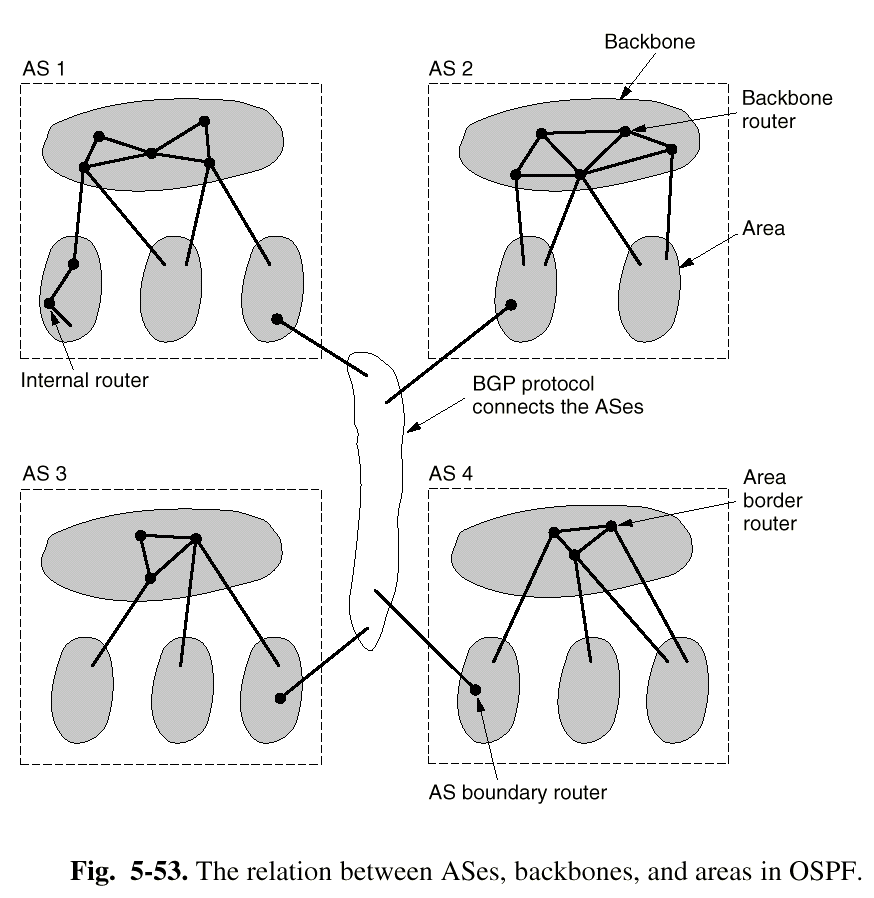

# 网原必会

！-> 重点

// -> 考纲上没出现

## 物理层

- 定义：提供机械、电器、功能、规程的特性，目的是启动、维护和关闭比特传输的物理连接。中继系统也是物理层的。
- 物理层功能：在两个设备之间提供透明的比特流传输

### **四个特性!**

#### **机械特性!**

- 物理连接边界点（接插装置），连接规格、引脚数量、排列等

#### **电气特性!**

- 信号的电压高低、阻抗匹配、传输速率、距离限制；不仅在边界点，还在发送器和接收器

#### **功能特性!**

- 物理线路的功能（数据，控制，定时，地）
  - 有几根线，每根线是啥作用

#### **规程特性!**

- 物理线路的工作规程、时序关系
  - 工作阶段划分/工作模式

### 传输介质

- //磁介质

#### 双绞线

- 模/数

#### 同轴电缆

- 基带：数字

- 宽带：模拟，300MHz/450MHz

#### 光纤

- 单模、多模（式）：每种波长能否有多种模式
- 模式：类似偏振方向
- 波长窗口（波段）：三个，分位于波长-衰减曲线的三个谷底，短波衰减大、便宜，长波衰减小

### 其他网络传输技术

- // 无线传输，电话系统，宽带ISDN，ATM技术，蜂窝无线电，通信卫星

#### SONET/SDH

- 采用TDM技术

## 网络层

- 网络层功能：屏蔽不同类型网络之间的差异，实现互连
- 虚电路子网与数据报子网的比较：有无连接，包的地址信息，状态信息，路由，结点故障的影响，数据拥堵的处理，服务质量的保障

### 路由算法

- 静态路由算法和动态路由算法：路由信息随不随网络状态改变
- 路由表：IP, next router, ...
- 分组交换：数据分组；转发

### 静态路由算法

#### 最短路径算法

- Dijkstra：路由表保存到所有其他节点的最佳路径

#### 洪泛法

- BFS：收到报文后向所有方向转发，不接受重复分组，适用于军用通信

#### 基于流量的路由算法

- FR：根据线路负荷和平均流量，用排队模型计算出分组平均时延，寻找产生网络最小延迟的路由

### **动态路由算法！**

#### **距离向量路由算法DV!**

- Bellman-Ford，存到每个目的地的已知最佳距离（跳数/时间）和线路
- 与相邻路由器交换最新的距离信息（地址+开销），更新老路由表
- 缺陷：线路故障时无限计算问题

#### **链路状态路由算法LS!**

- 对广播型网络引入人工结点
- 测试所有邻接结点的延迟状态
- 用洪泛法把链路状态传给网络上所有其他点，利用年龄和序号防止重复和过时信息
- 根据收到的链路状态用Dijkstra计算
- 和DV的区别：DV只靠链路状态报文来完成更新和距离计算；LS主动发包计算延迟，需要应答报文；DV只发给邻居，LS链路状态报文发送量大；DV可能导致收敛慢（无限计算），LS收敛快

### 分层路由

- 分而治之，路由器分区进行路由
  - 逻辑链：IP就是通过子网掩码进行分层的协议

### 移动主机的路由

- 移动用户，家乡位置，家乡代理（重庆移动），外部代理（北京移动）
- 外部代理广播，新进入区域的移动用户注册；外部代理和家乡代理联系确认，注册成功
- 数据通过家乡代理，采用隧道技术传给外部代理，再给移动用户

### **拥塞控制!**

- 不同于流量控制（点到点，局部问题），是子网的全局问题
- 基本方法：开环（设计、无状态控制）和闭环（监视、反馈、调整）

#### **流量整形!**

- 开环：强迫包以可预测的速率发送

##### **漏桶算法!**

- 强迫包以一定速率输出
- 桶溢出则包丢弃

##### **令牌桶算法!**

- 以恒定速度放入令牌，包需要得到令牌才能输出；溢出则丢弃令牌
- 无令牌则丢弃包

#### //流说明

- 发送方描述数据流的模式和希望得到的服务质量，称为流说明
- 子网和接收方可以答复同意/拒绝/其他建议

#### //虚电路子网拥塞控制

- 许可控制：在拥塞解决前不允许建立新虚电路；或可以建立但需要绕开拥塞
- 资源预留：建立虚电路时，子网根据协议为连接预留资源

#### //抑制包

- 闭环控制
- 监控输出线路，如果包输出属于警戒状态，向源主机发送抑制包并标记原包，以免后续路由器产生抑制包
- 源主机减少向目的地流量，开始监听，监听周期内忽略抑制包；如果监听时未收到抑制包则增加负载

#### //加权公平队列

- 公平队列：多个队列，依次逐包轮询（发送队头）
- 加权公平队列：不同的队列优先级不同，优先级高者时间片更多（发得更多）

#### //逐跳抑制包

- 抑制包对途经的每个路由器都起作用

#### 负载丢弃

- wine策略：丢新包，文件传输
- milk策略：丢旧包，多媒体服务
- 早期丢包更能提升性能

### 网络互联

- 多个网络（协议）构成互联网

#### 网络互联设备

##### 中继器

- 物理层

##### 桥

- 数据链路层

##### 路由器

- 网络层

##### 传输网关

- 传输层

##### 应用网关

- 应用层
- 半网关

#### //级联虚电路

- 优点：短包头，有顺序，服务质量（路由器预留缓存区）
- 缺点：虚电路信息大，拥塞容忍度/健壮性差，依赖子网可靠性

#### //无连接网络互联

- 优点：健壮性好，拥塞容忍度好，多种网络互联
- 缺点：长包头，无顺序，质量不保证

#### //隧道技术

- 不同类型的网络

#### //防火墙技术

#### //分段重组

- 不同网络包长不同，网关实现分段（大包过小包网）和重组（小包过大包网）

### **IPv4，ICMP，ARP!**

#### **IPv4地址!**

- 网络号+主机号
- 利用子网掩码来实现网络的分层
- 全0：本网络；全1：广播地址

#### **IP协议!**

- VER, IHL, ToS, TL, Id, DF, MF, OFF, TTL, Protocol, Chksum, Src, Dst, Opt
  - 版本
  - 头长度（可变长）、总长度
  - 服务类型Tos=Differentiated Services
    - 其中前6比特为使用的DSCP，后2比特未使用
    - 加速转发EF：101110
    - 确保转发AF：aaabb0
  - 标识域
  - 分段相关（DF,MF,OFF）
  - 生存期
  - 上层协议
  - 源汇地址
- 报头20字节+可变最多40字节

#### **ICMP!**

- 互联网控制报文协议
- 封装在IP包中，报告出错和测试
- ping：echo request & echo reply

#### ARP!

- 地址解析协议：解决IP和MAC的映射问题
- ARP表：IP, MAC对，有生存期
- 同一子网内用目的IP查找，否则用网关IP查找
- 未找到则发送广播包
- 启动时广播本机(IP, MAC)映射

### 路由协议

RIP, OSPF是内部网关协议IGP, BGP是外部网关协议EGP

#### RIP

- 路由信息协议：基于DV；AS内的路由算法；两个版本
- 30秒交换一次包含距离的路由表信息
  - 距离采用跳数，最多15跳
- 180秒未收到邻居，邻居失效，广播声明
- 水平分割和毒性反转：下一跳为邻居的项不发回去；发回去但跳数改到16

#### OSPF

- 开放最短路径优先：动态算法LS
- 网络构造有向拓扑图；分层路由；五种信息

- 自治系统内若干区域：只连到主干backbone
- 路由：（区域）内部router、区域边界router、主干router, 自治系统边界router

#### BGP

- 外部网管路由协议：域间路由协议，路径向量算法（类似于DV），记录路径轨迹而非距离
- 通过TCP连接传路由信息，向邻居广播所有通往目的地的路径

### **CIDR!**

- 无类域间路由
- 基于分类的IP浪费地址，不够用
- 先按需分配分C类地址，然后用最长匹配（掩码最长）原则查找路由
  - 最长匹配就可以支持把地址分成若干不同大小的块了

### IPv6

- 不兼容IPv4
- 地址128位、16字节，由8组、每组2字节表示，冒号隔开
  - 多个2字节0组可以用一对冒号替代；IPv4地址可在前加::
- 包头定长，取消IHL/Protocol/Checksum/分段相关域，主机路由器必须支持576字节的包
- 与IPv4混合的网络，采用双栈（两种协议）或隧道（IPv6被包成IPv4）
  - 混合：存在IPv4主机/路由器

## 传输层

### 传送服务

- 传送服务有面向连接和无连接的两种
- 1-4层称为传送服务提供者，4层以上称为传送服务用户

#### 传送层的作用

- 消除网络层的不可靠性，提供端对端的、可靠的、与网络无关的信息传输

#### 简单连接管理状态

### 可靠传送协议

#### 寻址

- 把进程挂在传输服务访问点TSAP上
  - Internet TSAP: (IP address, Local Port)
- 客户端获取TSAP的方法：预先约定；从名字服务器（又称目录服务器，DS）获得，而DS的TSAP是众所周知的
- 初始连接协议ICP：进程服务器(process server)进程(inetd)监听端口，远端向TSAP发送连接请求，若无服务程序监听则与进程服务器建立连接，进程服务器产生所需服务进程来继承
  - inetd: (日常巡逻)
  - 远方机器: 访问800接口
  - inetd: (皱眉)800接口没有服务程序啊
  - inetd: (建立连接)
  - inetd: Hi, this is port 800. We are creating a service process for you.
  - inetd: (生成800接口的服务进程SP800)
  - inetd: SP800, from now on you'll take over port 800!
  - inetd: (回去巡逻)
  - SP800: SP800 at your service.
  - 远方机器: (正常沟通)

#### 建立连接!

- 两次握手方案：可能因为网络层丢包/重复带来问题
  - A发出请求(CR TPDU)，B发回确认(CC TPDU)
  - (Transport Protocol Data Unit) = Segment，就是双方传输的包
- 三次握手方案：解决问题
  - A发出CR TPDU #X
  - B发出CC TPDU #Y，确认CR #X
  - A发出TPDU #X+1（开始通信），确认CC #Y

#### 释放连接!

- 非对称释放：一方释放连接DR，整个连接断开，可能丢失数据
- 对称式：两军问题导致不存在安全的释放方法；但一般采用三次握手+定时器

#### 流控和缓存

- 缓存：发送方的传输层实体必须缓存所有的TPDU
- 流控：可变滑动窗口协议（根据接收方实际缓存情况得出大小），为避免死锁应周期性发送TPDU

### TCP

#### 服务

- 通过套接字（地址表示为(IP, 端口号)）的连接
  - 256以下端口号被标准服务保留
- 提供点到点、全双工通道服务（描述为一条无向边(socket1, socket2)）
- 不支持多播、广播
- 

