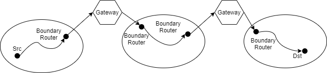

# 网原必会


！-> 重点

// -> 考纲上没出现


## 网络体系结构

组成：资源子网（服务器、终端）、通信子网（信道、互连设备）

### 通信方式

交换式通信：p2p，经过交换设备&转发，各种拓扑结构，路由技术

广播式通信：共享通信线路，p2a，总线/环形结构，通道分配技术

### 网络分类

局域网城域网广域网

无线网络卫星网络ATM

### 体系结构名词!

体系结构：对网络和部件的功能的精确定义，功能角度描述结构，层次和层间关系

对等进程：在不同计算机上对话的同一层通信的各方

服务：上下层交换信息遵循的规则

服务访问点SAP：有唯一识别地址，每层可以有多个

### 协议&分层结构!

- 协议：双方信息交换遵守的规则，由**语法语义定时关系**组成
- 语法（包的结构）、语义（动作的集合，你发了这个包后我应该做什么）、定时关系（时序）
- 协议的分层原则：不知道上下层服务内容，独立完成功能，使用下层服务，为上层提供服务
- 接口：下层向上层提供的操作、服务

接口数据单元IDU：上下传送的信息单元=上层的服务数据单元SDU+接口控制信息ICI

​	数据单元就是数据，服务数据单元就是上层想要收发的数据

协议数据单元PDU：同层传送的信息单元=SDU/分段+协议控制信息

### 服务分类和服务原语

连接/无连接服务

形式上由原语or操作来描述：请求、指示、响应、确认

### OSI

物理层数据链路层网络层传输层**会话层表示层**应用层

### TCP/IP模型

Host-to-network（物理/链路），Internet，传输层，应用层

### X.25分组交换网

面向连接，交换虚电路&永久虚电路

物理层，数据链路层，网络层


## 数据通信

### 傅立叶变换

其实是傅立叶级数（三角形式FS）

an：n次谐波的正弦振幅

bn：n次谐波的余弦振幅

### 有限带宽

- 绝对带宽、有效带宽（就信号而言）
- 信道的截止频率
- 波特率/调制速率：每秒信号变化的次数，Hz
- 比特率：每秒传输的二进制位数，bps，一般波特率/比特率=1或2
- 对于比特率为B bps的信道，如果8位为一个周期T，则一次谐波的频率为f1=B/8Hz
- 最高次谐波数目为N=fc/f1=fc*位数/B

### 传播速率上限

- Nyquist: 无噪声 2Hlog2 V (bps)，H是低通滤波器带宽，V是电平级数
  - 2H
- 信噪比：10log10 S/N (dB) 信号功率/噪声功率
- 香农定理：传输速率上限Hlog2 (1+S/N)
- 可以把上下两个取个最小值来得到合理一点的上限

### 数据表示与传输


数字信号的缺点：易衰减

### 数据编码：基带传输

基带：原始信号固有的频带，传输变换前占用的频带

基带传输：直接采用基带信号进行传输

- NRZ：`_-_-=0101` 
- Manchester：`_- _- -_ _- = 0010`，中间跳变是数据也可以做时钟
- DM：`_- _- -_ _- -_ -_ = 001110`，中间跳变，开头跳变为0不变为1，时钟数据分离
- 逢0跳变：`_-_----_ = 00001110`，逢零跳变和差分曼彻斯特都根据开头不同有两种情况

### 频带传输

在一定频率范围的线路上，进行载波传输

调制：用基带脉冲控制载波信号的参量

解调：反变换

- 幅移键控（调幅 AM）：频率、相位为常量，振幅是变量（如Asmall为0，Abig为1）
- 频……（FM）：频率为变量
- 相……（PM）：相位为变量

### 模拟数据数字传输

采样，将信号振幅分为2^n级，用n位去表示

差分脉冲代码调制：用前后采样值的差来编码

delta调制：前后采样值的差编码，用1位表示（01）

### 多路复用

时分复用TDM：T1载波，1.544Mbps,24个信道,每个8bit，7个是数据位

频分复用

波分复用（不同波长叠加）

### 交换方式

- 电路交换，建立时间长，延迟短，时分复用（发送接收同步）
- 报文交换，逻辑完整，缓冲大，延迟长
- 分组交换，比报文短
  - 含有src dst，独立路由；
  - 不预先为分组分配资源
  - 线路利用率高
  - 可重传（可靠）
  - 可开始新传输和控制优先级
  - 开销增加
  - 统计复用，按需分配
  - 无需等待时槽
  - 附加的分组头来区分数据
  - 带宽利用高，需处理拥塞
  - 数据包分组交换
  - 虚电路分组交换：保证顺序，分组头可以简化

> 分组交换方式：
>
> 我有d bit的数据
>
> 1. 分组，设分组大小为p bit数据+h bit头，那么一共有d/p组，总的要发的数据量为d(p+h)/p bit
> 2. 把这么多数据发到比特率为b bps的网络，需要的时间为d(p+h)/pb sec
> 3. 最后一个包肯定最晚到达，所以我们不考虑其他包，只考虑最后一个包的情况。这个包在路上经历了k跳（也就是中间有k-1个路由器），每一条传播延迟都为d sec。
>    1. 总的传播延迟为kd sec
>    2. 每经过一个路由器，都要重新转发。所以需要加上k-1个路由器转发的时间，也就是(k-1)(p+h)/b sec
> 4. 把上面的时间全部加起来就是总延迟（从开始发出数据到数据全部收到的时间）
>
> 电路交换，有一个电路建立时间，而没有重新转发的时间。


## 物理层

- 定义：提供机械、电器、功能、规程的特性，目的是启动、维护和关闭比特传输的物理连接。中继系统也是物理层的。
- 物理层功能：在两个设备之间提供透明的比特流传输

### **四个特性!**

#### **机械特性!**

- 物理连接边界点（接插装置），连接规格、引脚数量、排列等

#### **电气特性!**

- 信号的电压高低、阻抗匹配、传输速率、距离限制；不仅在边界点，还在发送器和接收器

#### **功能特性!**

- 物理线路的功能（数据，控制，定时，地）
  - 有几根线，每根线是啥作用

#### **规程特性!**

- 物理线路的工作规程、时序关系
  - 工作阶段划分/工作模式

### 传输介质

- //磁介质

#### 双绞线

- 模/数

#### 同轴电缆

- 基带：数字

- 宽带：模拟，300MHz/450MHz

#### 光纤

- 单模、多模（式）：每种波长能否有多种模式
- 模式：类似偏振方向
- 波长窗口（波段）：三个，分位于波长-衰减曲线的三个谷底，短波衰减大、便宜，长波衰减小

### 其他网络传输技术

- // 无线传输，电话系统，宽带ISDN，ATM技术，蜂窝无线电，通信卫星

#### SONET/SDH

- 采用TDM技术

## 数据链路层

- 定义：为了提供**功能**和规程上的方法，以**建立、维护、释放**网络实体间的数据链路
- 数据链路：数据发送点到数据接收点经过的传输途径
  - 虚拟数据链路：通过数据链路层传输
  - 实际数据链路：通过物理层传输
- 控制规程：使数据迅速正确有效传到需要采用的控制方式
- 功能：正常传输=建立、维护、释放；定界与同步；差错；顺序；流量控制

- 服务：
  - 无确认无连接
  - 有确认无连接
  - 有确认有连接

#### 成帧

- 把比特流分散为帧，计算帧的校验和

- 成帧方法：确定帧的边界

  - 字符计数法：帧头中含有帧的字符数（缺点：计数不能出错）

    > 帧头本身也算在长度里面

  - 带字符填充：起始字符DLE STX，结束字符DLE ETX（局限于ascii或8位字符）

  - 带位填充：起始结束01111110（需要0比特插入删除技术，即每5个1就需要插入一个0）

  - 物理层编码违例法：利用物理层编码冗余

  - 一般用字符计数法+一种其他方法

#### 差错控制

- 接收方给发送方一个反馈（响应帧）
- 出错：帧出错、帧丢失
- 计时器+序号保证每帧交给目的网络层仅一次

#### 流量控制（主要在传输层实现）（那你在这里写？？）

### 错误检测和纠正

- 差错：随机、连续突发
  - 连续突发：一下子连着错好几位
- 基本策略：纠错码、检错码

#### 纠错码

- 码字：数据+校验位=码字codeword，其位数为前两者之和
- 海明距离：两个码字的不同比特位数目
- 我记得奇偶校验码海明距离为2，海明码的距离为4
- 检错d位的码距为d+1，纠错d位的码距为2d+1
- 海明码的用法：把码字按行组成矩阵（每行一个码字），**按列发送**（连续突发.jpg）

#### 检错码

- 循环冗余码：CRC码，如110001 -> x^5+x^4+1
- 生成多项式G(x)：双方的约定，高位低位必须为1，必须比传输信息对应的多项式短
- 校验和加在帧尾，带校验和的帧的多项式能被生成多项式除尽
- 发送方，校验和的计算：G(x)为r阶，则帧为m位+r个0，多项式x^rM(x)；用G去模2除x^rM(x)；用模2减法从其位串中减去余数（模2运算=不进位不退位；减余数=加）
- G(x)的阶数=校验位长度=G(x)的项数-1；
- 国际标准：CRC-12={12, 11, 3, 2, 1, 0}; CRC-16={16, 15, 2, 0}; CRC-CCITT={16,12,5,0}
- 结论：
  - G(x)至少两项（单比特），
  - G(x)不是x^k+1的因子（两比特），
  - x+1是G(x)的因子（奇数个比特），
  - 如果把所有错误看作一个连续突发错误，那么能查出长<=r的连续突发性错误（错误的阶为r-1）（校验码为r位），
  - 对长度=r+1的突发差错，查不出来的概率为1/2^(r-1)，突发差错和G(x)须相同
  - 长度大于r+1的突发差错发生后，坏帧被接收的概率为1/2^r

### 基本数据链路层协议

#### 无约束单工协议

- 前提：单工传输，发送方信息无限多，接收方缓冲区无限大，信道不损坏/丢失帧
- 发送方：取数据成帧发送
- 接收方等待、接受帧、给数据给高层

#### 单工停等协议

- 前提叠加：接收方缓冲区有限
- 发送方：取数据、成帧、发送、等接收方发送响应
- 接收方：等待、接受帧、送数据、发送响应帧

#### 有噪声信道的单工协议

- 前提叠加：信道有差错，信息会丢失/损坏
- 发送方：出错重传，没收到响应帧就定时重传
- 接收方：由于响应帧损坏可能收到重复帧；帧头放入序号，序号取1位
- PAR / ARQ （通过重传的正向确认/自动重复请求）：发下一个帧前等待确认帧
  - 请求：等待响应
  - 由于确认帧无序号，发送和接收严格交替进行
    - 交替进行的含义：A发送#1，B接收#1，A发送#2必须先后进行；注意不是A发送#1，A受到ack#1，A发送#2

### 滑动窗口协议

- 前提叠加：全双工
- 捎带：延迟确认信息，附加下一个待发数据帧
- 信息帧带有序号，序号从0~2^n-1循环，所以窗口也是一个循环的窗口
  - 例如序号空间0~3，那么滑动窗口就在0 1 2 3 0 1 2 3...的序列上面滑动
- 发送端保持已发送且未确认的帧的序号表（发送窗口），上界=要发的下一个帧序号，下界=未得到确认的帧的最小编号，发送窗口=上界-下界（可变）
  - [下界,上界)=窗口元素列表
- 发送端每发一个帧，上界+1；每接受一个正确响应帧，下界+1
  - 如果来了一个错误响应帧，重发下界的帧
- 接收端的接收窗口大小固定，上界=允许接收的序号最大的帧，下界=希望接受的帧
- 窗口外的帧均丢弃，序号等于下界的帧正确接收，产生响应帧，下界+1，上界+1

#### 一比特滑动窗口协议

- 窗口大小=1，发送序号和接受序号的范围为0和1
- 双向数据传输，信息帧中可以含有确认信息，信息帧中包括发送序号和接收序号（确认信息，表示已收到的帧的序号）
- **基于停等方式**
- 效率低，若双方同时开始发送，会有一半重复帧

举例

```
format: (seq, ack, PacketId); * -- receiver accepts
0/0: sender window/receiver window
Alice							Bob
------------------------------------------------------------
0/0:send (0, 1, A0)				0/0:-
0/0:-							0/0:get (0, 1, A0)*
0/0:-							0/1:send (0, 0, B0)
0/0:get (0, 0, B0)*				0/1:-
1/1:send (1, 0, A1)				0/1:-
1/1:-							0/1:[A1 corrupted]
1/1:-							0/1:send (0, 0, B0) [resend]
1/1:get (0, 0, B0)				0/1:-
1/1:send (1, 0, A1)				0/1:-
1/1:-							0/1:get (1, 0, A1)*
1/1:-							1/0:send (1, 1, B2)
1/1:get (1, 1, B2)              1/0:-
0/0:send (0, 1, A2)
```


```
format: (seq, ack, PacketId); * -- receiver accepts
0/0: sender window/receiver window
Alice							Bob
------------------------------------------------------------
0/0:send (0, 1, A0)				0/0:send (0, 1, B0)
0/0:get (0, 1, B0)*				0/0:get (0, 1, A0)*
0/1:send (0, 0, A0)				0/1:send (0, 0, B0)
0/1:get (0, 0, B0)				0/1:get (0, 0, A0)
1/1:

```

> 搞清楚捎带情况下信道利用率的计算。

---

每次发一帧就等待确认一帧很浪费信道带宽：

- 信道带宽b bit/s，帧长度为l bit，往返传输延迟为R，忽略确认帧发送时间，则利用率为(帧的传输时间/总用时)=(l/b) / (l/b + R/2 + R/2) = l/(l + Rb)
- 尽量提高l：连续发送多帧再等待确认（流水线技术）
- 缺点：重传会很多

基本方法：

#### 退后n帧协议

- 接收方从出错帧开始丢弃所有后续帧，接收窗口为1
- 发送方从坏帧开始重传
- 发送方发送窗口满了就停止网络层（流量控制）
- 对出错率高的信道，浪费带宽
- 发送窗口尺寸<序号个数
- 多个未确认帧，需要多个计时器

```
Alice(Sender)					Bob(Receiver)
-------------------------------------------------------------
[0,1):send(0, A0)				0:
[0,2):send(1, A1)				0:get(0, A0)*
[0,3):send(2, A2)				1:send(ack0)
								  get(1, A1)*
[0,4):send(3, A3)				2:send(ack1)
	  get(ack0)					  [(2, A2) corrupted]
	  (cache full, disable Network Layer)
[0,4):get(ack1)					2:get(3, A3)
[1,4):(enable Network Layer)
[1,4):(timer2)					2:get(4, A4)
[0,3):send(2, A2)
[0,4):send(3, A3)				2:get(2, A2)*
```

> 发送方需要足够大的窗口，定时器需要足够长，以保证确认帧能够回来。
>
> 定时器的长度>=一帧数据的发送时间+传输延迟*2。
>
> > 发送方的窗口大小可变，所以上限是序列号空间。
>
> 以长度为3000km的T1信道（1.544Mbps）为例，假设传输速度为6us/km，一个64 bit帧的发送时间为～0.33ms，而信道来回要36ms，所以定时器至少要36.33ms。这个时间段足够发送36.33/0.33=110帧，所以序列号空间至少要有7位（128）。

#### 选择重传协议

- SR条件：如果最大的序号为MaxSeq，则接收窗口=(MaxSeq+1)/2，即不超过序号空间的一半（接收窗口前移后不能与原窗口重叠）
- 接收方暂存坏帧后续帧，发送方重传坏帧，当接收方得到下界的帧时移动窗口
- 重叠的危险：(序号为0～3，窗口大小为3)如果移动窗口([0 1 2] 3 => [3 0 1] 2)、发回ack后，ack丢失，那么发送方会重传之前的包(序号0)。此时这些包可能会落到新窗口里面，接收方无法将其与新包分开。


## 局域网和介质访问子层

2倍时间才知道发生冲突：A发送，快到B了，B发送，乓！碰撞传到A

A x...... B

A ....xy B

A ......* B

A *...... B

但A什么时候知道x发送成功（没有冲突）呢？你看，如果A发了两个短帧到B，回来一个*，那么A怎么知道哪个有冲突呢？

所以A一般是在发送过程中监听，如果有冲突就是当前发送这个帧产生冲突。那么你就知道了，在冲突送到之前，不能发完了。所以帧的长度l必须满足l(bits)/带宽(bps)>=2信道延迟(s)

### ALOHA协议

- 随意发送，检测冲突再重发

#### Pure ALOHA

用户直接发送信息到信道，监听冲突，若冲突则等待随机时间重发

- 单个用户等待随机时间指：对于整个信道（无限个用户），每一刻都有相同的概率发与不发=每帧时内发的帧数满足泊松分布

  - 帧时frame time=每个帧发送需要的时间

  - 参数G=attempts per frame time表示整个网络平均每个帧时发送G帧，则每帧时产生k帧的概率

    <p style="text-align:center">P[k]=G^ke^(-G)/k!</p>

- 正常传输概率P0：发送一帧不受冲突影响的概率。在“冲突危险区”也即**两个帧时**之内无其他帧产生的概率为e^(-2G)

  

- 信道效率（吞吐率：有效传输数据的效率）S=GP0：S=Ge^(-2G)，G=0.5时为0.184

#### Slotted ALOHA

信道时间分成离散的时间槽，槽长正好为1帧。槽开始时发送。

- 信道效率为Ge^(-G)<=0.368【G=1】，因为危险区变成了Pure ALOHA的一半

### CSMA

- 载波监听多路访问，空了才发送
  - **监听：要等待2t的时间才能确定空了**
- 但是空了也不一定没有冲突（因为信号可能还没到这边来），所以发送站点在传输过程中仍然继续监听介质是否冲突,如果冲突了就像ALOHA那样等待随机时间再发送

#### 1-坚持型CSMA

发送前监听，只要通道空就发送；导致冲突大

#### 非坚持型CSMA

发送前监听，如果通道空就发送，通道不空就随机等待一段时间，再监听（如此往复）；利用率高、冲突小但延迟大

#### P-坚持型CSMA

分时间槽通道。与1-坚持型不同的是：如果通道空，以概率p发送（1-坚持型的p=1）

- 在用户无限的情况下，0.01-persistent CSMA在G>=3时基本上让利用率达到1

#### CSMA with CD（冲突检测）

- 检测到冲突就停止，发出干扰通知所有站点
- 发出干扰后，等待随机时间再发送

### 无冲突协议

- 站点状态可分为传输周期、竞争周期、空闲周期

#### 基本位图协议

竞争周期N个时槽，每个要发的站点在对应时槽发1，竞争周期后所有站点都知道谁要发，按序号发

效率：轻负载【只有一个要发，帧长d】d/(d+N)，重负载【都要发，帧长d】d/(d+1)

缺点：序号带来不平等；每个站点有1周期开销

#### 令牌环协议

按一定的顺序传递令牌，得到令牌的站点可以发送信息

#### 二进制下数法

分槽，想占用信道就广播地址（地址等长），所以每一刻所有广播者的地址就被或起来。当广播者看到本站的0位变成1，就放弃发送。

> 比如有四个发送者：
>
> 0010
>
> 0100
>
> 1001
>
> 1010
>
> 第一时间发送它们的高位 0,0,1,1  前两者放弃
>
> 第二时间后两者发送0,0
>
> 第三时间发送0,1，第三个放弃
>
> 第四时间最后一个发送0
>
> 结果：1010取得发送权

效率：d/(d+log2N)；可以让帧的一开始就为地址，这样效率可达100%

### 有限竞争协议

将站分组，组内竞争

#### 适应树搜索协议

站点组成二叉树


第0槽我们在#1（结点1），所有站都可以竞争。

如果只有一个要发，则发送。

如果ACE都要发：第一槽我们在#2，AC竞争；#3里的E留给AC竞争成功之后再发

第二槽，我们在#4，只有发A；#5留给#4成功后发。

第三槽，我们在#5，只有发C；

第四槽，我们回到#3，发E。

如果GH都要发：第一槽我们在#2，发现没有(idle)；第二槽我们在#3，发现冲突；第三槽我们在#6，idle；第四槽我们在#7，冲突；第五槽发G；第六槽发H。

如果负载重，考虑从中间层开始再竞争；像上面GH的场景，#2 idle后可以跳过#3（因为必然冲突），直接到#6，然后跳过#7，直接G和H。

### 无线局域网协议

短距离传输=一个站点的信号只能被相邻站点收到

- 隐藏站点问题：B--A--C，B和C都会给A发数据，在A产生冲突（相干）
- 暴露站点问题：B--A--C--D，A给B发数据被C监听，C害怕产生干扰，不给D发数据
- MACA：A发送RTS（发送请求）给B，B发送CTS（发送确认）给A，A开始发送。监听到RTS的A的附近设备不能发送CTS给A，监听到CTS的B的附近设备需要在传输过程中保持静默（CTS包含长度）。

### LAN模型

#### MAC子层

- 介质访问控制，数据帧封装、发送、接收（组帧，寻址，差错检测）
- 介质分配与冲突解决

#### LLC子层

- 逻辑链路控制，提供确认机制和流量控制，隐藏MAC子层差异
- 不可靠数据包服务、有确认数据包服务、可靠的面向连接的服务
- 基于HDLC协议的帧头

### IEEE 802.3：Ethernet!

- Manchester
- 10Base5：10Mbps，基带传输，500m
  - 10Base2，10Base-T(twisted pair)，10Base-F(iber optics)
- 帧发送时间应该大于2t，以避免帧的第一个比特到达电缆远端前帧就发完了
- 10Mbps LAN：规定，以太网时隙为51.2微秒（最多500m×5，因为可以接四个中继器；在双绞线里传播速率为0.7c；中继器也有相应的延时；一帧的最小发送时间大于等于2t），这段时间可以传512位，所以最短帧长64字节
  - 100Mbps LAN最多250m，所以最短帧长也是64字节

#### 二进制指数后退算法!

- 冲突发生后的时间划分为51.2us的槽
- 第i次冲突后随即选一个等待的时槽数(**0~2^i-1**)，再重传，等待时间中i最大取10；16次发送失败以后，报告上层

### IEEE 802.5 & token ring

- 发送之前需要得到令牌且移除出环
- 令牌必须短，环的时延（1 bit per station + 信号传播延迟）要能容下；可能需要插入人工延时
- 环接口操作模式：监听、传输模式

### 网桥!

- **将不同的、物理距离远的LAN连接，帧的存储、转发，保密**
- **透明网桥！**：接受所有帧，刚启动时洪泛转发，转发时逆向学习发送端口和地址的关系
- 源路由网桥：帧发送者设计发送路线

## 网络层

- 网络层功能：屏蔽不同类型网络之间的差异，实现互连
- 虚电路子网与数据报子网的比较：有无连接，包的地址信息，状态信息，路由，结点故障的影响，数据拥堵的处理，服务质量的保障

### 路由算法

- 静态路由算法和动态路由算法：路由信息随不随网络状态改变
- 路由表：IP, next router, ...
- 分组交换：数据分组；转发

### 静态路由算法

#### 最短路径算法

- Dijkstra：路由表保存到所有其他节点的最佳路径

#### 洪泛法

- BFS：收到报文后向所有方向转发，不接受重复分组，适用于军用通信

#### 基于流量的路由算法

- FR：根据线路负荷和平均流量，用排队模型计算出分组平均时延，寻找产生网络最小延迟的路由

### **动态路由算法！**

#### **距离向量路由算法DV!**

- Bellman-Ford，存到每个目的地的已知最佳距离（跳数/时间）和线路
- 与相邻路由器交换最新的距离信息（地址+开销），更新老路由表
- 缺陷：线路故障时无限计算问题

#### **链路状态路由算法LS!**

- 对广播型网络引入人工结点
- 测试所有邻接结点的延迟状态
- 用洪泛法把链路状态传给网络上所有其他点，利用年龄和序号防止重复和过时信息
- 根据收到的链路状态用Dijkstra计算
- 和DV的区别：DV只靠链路状态报文来完成更新和距离计算；LS主动发包计算延迟，需要应答报文；DV只发给邻居，LS链路状态报文发送量大；DV可能导致收敛慢（无限计算），LS收敛快

### 分层路由

- 分而治之，路由器分区进行路由
  - 逻辑链：IP就是通过子网掩码进行分层的协议

### 移动主机的路由

- 移动用户，家乡位置，家乡代理（重庆移动），外部代理（北京移动）
- 外部代理广播，新进入区域的移动用户注册；外部代理和家乡代理联系确认，注册成功
- 数据通过家乡代理，采用隧道技术传给外部代理，再给移动用户

### **拥塞控制!**

- 不同于流量控制（点到点，局部问题），是子网的全局问题
- 基本方法：开环（设计、无状态控制）和闭环（监视、反馈、调整）

#### **流量整形!**

- 开环：强迫包以可预测的速率发送

##### **漏桶算法!**

- 强迫包以一定速率输出
- 桶溢出则包丢弃

##### **令牌桶算法!**

- 以恒定速度放入令牌，包需要得到令牌才能输出；溢出则丢弃令牌
- 无令牌则丢弃包

#### //流说明

- 发送方描述数据流的模式和希望得到的服务质量，称为流说明
- 子网和接收方可以答复同意/拒绝/其他建议

#### //虚电路子网拥塞控制

- 许可控制：在拥塞解决前不允许建立新虚电路；或可以建立但需要绕开拥塞
- 资源预留：建立虚电路时，子网根据协议为连接预留资源

#### //抑制包

- 闭环控制
- 监控输出线路，如果包输出属于警戒状态，向源主机发送抑制包并标记原包，以免后续路由器产生抑制包
- 源主机减少向目的地流量，开始监听，监听周期内忽略抑制包；如果监听时未收到抑制包则增加负载

#### //加权公平队列

- 公平队列：多个队列，依次逐包轮询（发送队头）
- 加权公平队列：不同的队列优先级不同，优先级高者时间片更多（发得更多）

#### //逐跳抑制包

- 抑制包对途经的每个路由器都起作用

#### 负载丢弃

- wine策略：丢新包，文件传输
- milk策略：丢旧包，多媒体服务
- 早期丢包更能提升性能

### 网络互联

- 多个网络（协议）构成互联网

#### 网络互联设备

##### 中继器

- 物理层

##### 桥

- 数据链路层

##### 路由器

- 网络层

##### 传输网关

- 传输层

##### 应用网关

- 应用层
- 半网关

#### //级联虚电路



- 优点：短包头，有顺序，服务质量（路由器预留缓存区）
- 缺点：虚电路信息大，拥塞容忍度/健壮性差，依赖子网可靠性

#### //无连接网络互联

- 优点：健壮性好，拥塞容忍度好，多种网络互联
- 缺点：长包头，无顺序，质量不保证

#### //隧道技术

- 不同类型的网络

#### //防火墙技术

#### //分段重组

- 不同网络包长不同，网关实现分段（大包过小包网）和重组（小包过大包网）

### **IPv4，ICMP，ARP!**

#### **IPv4地址!**

- 网络号+主机号
- 利用子网掩码来实现网络的分层
- 全0：本网络；全1：广播地址

#### **IP协议!**

- VER, IHL, ToS, TL, Id, DF, MF, OFF, TTL, Protocol, Chksum, Src, Dst, Opt
  - 版本
  - 头长度（可变长）、总长度
  - 服务类型Tos=Differentiated Services
    - 其中前6比特为使用的DSCP，后2比特未使用
    - 加速转发EF：101110
    - 确保转发AF：aaabb0
  - 标识域
  - 分段相关（DF,MF,OFF）
  - 生存期
  - 上层协议
  - 源汇地址
- 报头20字节+可变最多40字节

#### **ICMP!**

- 互联网控制报文协议
- 封装在IP包中，报告出错和测试
- ping：echo request & echo reply

#### ARP!

- 地址解析协议：解决IP和MAC的映射问题
- ARP表：IP, MAC对，有生存期
- 同一子网内用目的IP查找，否则用网关IP查找
- 未找到则发送广播包
- 启动时广播本机(IP, MAC)映射

### 路由协议

RIP, OSPF是内部网关协议IGP, BGP是外部网关协议EGP

#### RIP

- 路由信息协议：基于DV；AS内的路由算法；两个版本
- 30秒交换一次包含距离的路由表信息
  - 距离采用跳数，最多15跳
- 180秒未收到邻居，邻居失效，广播声明
- 水平分割和毒性反转：下一跳为邻居的项不发回去；发回去但跳数改到16

#### OSPF

- 开放最短路径优先：动态算法LS
- 网络构造有向拓扑图；分层路由；五种信息


- 自治系统内若干区域：只连到主干backbone
- 路由：（区域）内部router、区域边界router、主干router, 自治系统边界router

#### BGP

- 外部网管路由协议：域间路由协议，路径向量算法（类似于DV），记录路径轨迹而非距离
- 通过TCP连接传路由信息，向邻居广播所有通往目的地的路径

### **CIDR!**

- 无类域间路由
- 基于分类的IP浪费地址，不够用
- 先按需分配分C类地址，然后用最长匹配（掩码最长）原则查找路由
  - 最长匹配就可以支持把地址分成若干不同大小的块了

### IPv6

- 不兼容IPv4
- 地址128位、16字节，由8组、每组2字节表示，冒号隔开
  - 多个2字节0组可以用一对冒号替代；IPv4地址可在前加::
- 包头定长，取消IHL/Protocol/Checksum/分段相关域，主机路由器必须支持576字节的包
- 与IPv4混合的网络，采用双栈（两种协议）或隧道（IPv6被包成IPv4）
  - 混合：存在IPv4主机/路由器

## 传输层

### 传送服务

- 传送服务有面向连接和无连接的两种
- 1-4层称为传送服务提供者，4层以上称为传送服务用户

#### 传送层的作用

- 消除网络层的不可靠性，提供端对端的、可靠的、与网络无关的信息传输

#### 简单连接管理状态

### 可靠传送协议

#### 寻址

- 把进程挂在传输服务访问点TSAP上
  - Internet TSAP: (IP address, Local Port)
- 客户端获取TSAP的方法：预先约定；从名字服务器（又称目录服务器，DS）获得，而DS的TSAP是众所周知的
- 初始连接协议ICP：进程服务器(process server)进程(inetd)监听端口，远端向TSAP发送连接请求，若无服务程序监听则与进程服务器建立连接，进程服务器产生所需服务进程来继承
  - inetd: (日常巡逻)
  - 远方机器: 访问800接口
  - inetd: (皱眉)800接口没有服务程序啊
  - inetd: (建立连接)
  - inetd: Hi, this is port 800. We are creating a service process for you.
  - inetd: (生成800接口的服务进程SP800)
  - inetd: SP800, from now on you'll take over port 800!
  - inetd: (回去巡逻)
  - SP800: SP800 at your service.
  - 远方机器: (正常沟通)

#### 建立连接!

- 两次握手方案：可能因为网络层丢包/重复带来问题
  - A发出请求(CR TPDU)，B发回确认(CC TPDU)
  - (Transport Protocol Data Unit) = Segment，就是双方传输的包
- 三次握手方案：解决问题
  - A发出CR TPDU #X
  - B发出CC TPDU #Y，确认CR #X
  - A发出TPDU #X+1（开始通信），确认CC #Y

#### 释放连接!

- 非对称释放：一方释放连接DR，整个连接断开，可能丢失数据
- 对称式：两军问题导致不存在安全的释放方法；但一般采用三次握手+定时器

#### 流控和缓存

- 缓存：发送方的传输层实体必须缓存所有的TPDU
- 流控：可变滑动窗口协议（根据接收方实际缓存情况得出大小），为避免死锁应周期性发送TPDU

### TCP

#### 服务

- 通过套接字（地址表示为(IP, 端口号)）的连接
  - 256以下端口号被标准服务保留
- 提供点到点、全双工通道服务（描述为一条无向边(socket1, socket2)）
- 不支持多播、广播
- 基于字节流而非消息流
- 使用PUSH标记来强迫数据发送

#### 问题

- 可靠传输：滑动窗口
- 流量控制：可变滑动窗口
- 连接管理：三次握手+定时器

#### 协议

- 序列号：按字节流分配
- 使用段 segment（TPDU）交换数据，段大小满足IP数据净荷长度限制和MTU限制
- 滑动窗口协议，要确认序号等于接收方希望接受的下一个序号

#### 传输策略

- 窗口管理：基于确认和可变窗口大小；窗口大小为0时仅可发送1字节TCP段
- 改进传输层性能：
  - 发送方缓存，大段输出
  - acknowledgement of delay:确认段尽量捎带数据；不可能捎带数据时，接收方延迟发送确认段
  - Nagle算法：（以下缩进格数代表时间顺序）
    - 应用程序------1 byte------>传输实体
      - 传输实体------1 byte------>接收者
      - 应用程序-------->传输实体(缓存)
        - 接收者-----ack 1 byte----->传输实体
          - 传输实体-------缓存-------->接收者
          - 应用程序------>传输实体(缓存)
            - ...
  - Clark算法解决傻窗口症状（如果接收方缓存满了，而应用程序一次读一个字节，那么每次读一个字节就会空一个字节的缓存出来，接收方就会把窗口设为一字节，发一个新的窗口更新段给接收方，这样两边就会长时间以一字节通讯）：接收方只有具备一半的空缓存/最大段长的空缓存时才产生一个窗口更新段

#### 拥塞控制

- 快网络、接收方小缓存（接受能力）
- 慢网络、接收方大缓存（网络能力）

第一种：连接建立时声明最大可接受段长度；可变滑动窗口协议

第二种：发送方维护可变发送窗口和拥塞窗口，拥塞窗口根据慢启动和拥塞避免算法变化

#### 慢启动!

拥塞窗口初值为连接允许的最大段长（max 64k）

> 一次发一个，确认之后窗口变两个，发两个，确认之后窗口变四个

发出一个最大段长的段，得到确认，拥塞窗口变为两个最大段长

发出(拥塞窗口/最大段长)个最大段长后加倍拥塞窗口

#### 拥塞避免！

直到大于阈值，拥塞窗口线性增长，直到发生丢包超时

超时后阈值变为拥塞窗口的一半，拥塞窗口重设为1个最大段长，慢启动

